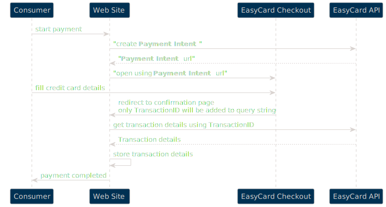

EasyCard Next Generation API v1 - _Checkout Page (Redirect Page)_
==============

> The simple way to collect payments hosted by EasyCard.

Dear customer,
The purchase process on an e-commerce site includes three steps: searching for products to buy, filling in delivery details and making a purchase on a payment page. 
The most sensitive in the process is the payment page.

One option is to enter the payment information on the site itself, but then the entire site, software and servers, must meet the PCI standard and go through a long and expensive certificate process. 
The more recommended option is to use the Redirect interface, the user is redirected to a payment page located on a remote server and is part of the website of a company certified by the PCI standard. This ensures that the payment page has passed testing and certification as part of that company’s certification. 
This saves a lot of time in developing the clearing interface,
Makes it easier for the site to get approval from the credit card companies and most importantly gives peace of mind that the credit data is secure and not stored at all on the trading site.  


EasyCard’s Redirect debit page is included in the company’s PCI certification, PCI DSS Level 1 and is secured according to the strongest standards of credit card companies and ensures secure execution of credit charges. 

# Environments

## API addresses

|Environment|API|Address|
|---|---|---|
|Sandbox|Transactions API|https://ecng-transactions.azurewebsites.net|
||Metadata API|https://ecng-profile.azurewebsites.net|
||Identity Server|https://ecng-identity.azurewebsites.net|
|Stage|Transactions API|https://api-stage.e-c.co.il|
||Metadata API|https://merchant-stage.e-c.co.il|
||Identity Server|https://identity-stage.e-c.co.il|
|Live|Transactions API|https://api.e-c.co.il|
||Metadata API|https://merchant.e-c.co.il|
||Identity Server|https://identity.e-c.co.il|

> Please use our [Postman examples](/postman) if needed
> Please see [PHP examples](examples/EasyCard-Checkout-PaymentIntent-v1.php)

## Checkout Page addresses

|Environment|Address|
|---|---|
|Sandbox|https://ecng-checkout.azurewebsites.net|
|Stage|https://checkout-stage.e-c.co.il|
|Live|https://checkout.e-c.co.il|

<br/><br/>

# Checkout Page - common information

There are two options to generate Checkout Page:
 - classic style with query string which contains all deal parameters (which can be used first of all to support legacy systems)
 - Payment-Intent based Checkout Page

 

> Please note that under the hood Checkout Page generates regular payment transaction, so all documentation and settings related to transactions are relevant also for transactions generated by Checkout Page - please see corresponding documentation.

> Checkout Page url for live environment is [https://checkout.e-c.co.il](https://checkout.e-c.co.il)

<!-- <div style="page-break-after: always;"></div> -->

<br/><br/>

> Checkout page can be opened inside iframe

- - -

## Configuration in EasyCard Merchant's Portal

On EasyCard Merchant's portal [https://merchant.e-c.co.il](https://merchant.e-c.co.il) there are few settings related to Checkout Page. To open the settings page you need to press on your user name link:


<br/>

- - -

### Redirect urls

Then you need to find **Checkout Redirect URLs** section:


Please add base address of your website here. You can use several base addresses. ``RedirectUrl`` in query string described above should belongs to one of the configured base urls.

<br/>

- - -

### Custom logo and stylesheet

You can specify custom logo image and custom css file. Please use **Checkout** section and **Payment Request** section:


<br/>

# Classic Checkout Page

Please refer to: [ClassicCheckoutPage](ClassicCheckoutPage.md) 

# Advanced Checkout Page

EasyCard Next Generation also provides more secured and solid way to collect Checkout transactions using Payment Intent API:

 

The general idea is to keep all information required for Checkout Page securely in structured way (which is more convenient than query string). You can use `Create Payment Intent API method` to create it. This method returns short url which you can use to redirect your consumer to Checkout Page (so, in other words this method creates payment link).

As soon consumer will enter credit card details and pressed `Pay With EasyCard` button, Checkout Page will be redirected to the link, specified in `Create Payment Intent` parameters. EasyCard `TransactionID` will be added to redirect url.

Then you can use this `TransactionID` to get payment transaction details from the API - please use `Get Transaction Details` method.

Please find out API description in section below.

> Please note, all request should be secured with Authorization header `Bearer {{access_token}}` - see **Authentication** section below to get information about how to obtain this token.

> You can simple check how this functionality works by using **Payment Link** feature on Merchant's Portal:


<br/><br/>

# EasyCard Next Generation API v1 - _Transactions API (sections related to Checkout Page)_


> Please check details in full API description using swagger:

Development version: [https://ecng-transactions.azurewebsites.net/api-docs/index.html](https://ecng-transactions.azurewebsites.net/api-docs/index.html)
Live version: [https://api.e-c.co.il/api-docs/index.html](https://api.e-c.co.il/api-docs/index.html)

> Live transactions api address is [https://api.e-c.co.il](https://api.e-c.co.il)

<br/><br/>

- - -

## Authentication

### Authentication/Authorization type

* Bearer (oauth2)
    - Parameter Name: **Authorization**, in: header. Standard Authorization header using the Bearer scheme. Example: `bearer {access_token}`

### Get Access Token

`POST {{IdentityServerAddress}}/connect/token`

> Live Identity Server Address is [https://identity.e-c.co.il](https://identity.e-c.co.il)

> Headers

|Name|Value|
|---|---|
|Content-Type|application/x-www-form-urlencoded|

> Body parameter (`x-www-form-urlencoded`)

```php
<?php

$ch = curl_init();

curl_setopt($ch, CURLOPT_URL,"https://identity.e-c.co.il/api/token");
curl_setopt($ch, CURLOPT_POST, 1);
curl_setopt($ch, CURLOPT_POSTFIELDS,
            "client_id=terminal&grant_type=terminal_rest_api&authorizationKey=hL5pXeI96df0wxCb....IWYcmhJH2bye1gg==");
curl_setopt($ch, CURLOPT_HTTPHEADER, array('Content-Type: application/x-www-form-urlencoded'));


// receive server response ...
curl_setopt($ch, CURLOPT_RETURNTRANSFER, true);

$server_output = curl_exec ($ch);

curl_close ($ch);

// further processing ....
if ($server_output == "OK") { ... } else { ... }

?>
```

|Name|Value|
|---|---|
|client_id|terminal|
|grant_type|terminal_rest_api|
|authorizationKey|{{TerminalApiKey}}|

You can get `TerminalApiKey` by using `Reset Private Key` button on merchant's portal:


> Please note - you need to store given key securely. You cannot get active value from the merchant's portal - you only can reset current value (new key will be generated and old key will be no longer valid)

> Response

```json

{
    "access_token": "eyJhbGciOiJSUzI1NsImtpZCI6Ij.....q7MQ8jfwbQ_JKJif_7lTuiVhOGWA",
    "expires_in": 86400,
    "token_type": "Bearer",
    "scope": "transactions_api"
}

```

|Name|Type|Description|
|---|---|---|
|access_token|string|Value which should be added to each API request in Authorization header with Bearer prefix `Bearer {{access_token}}`|
|expires_in|number|number of seconds before token will be expires|
|access_token|string|always Bearer|
|scope|string|API scope|


<br/><br/>

- - -

## Create Payment Intent _(payment link)_

> Code samples

```php
<?php

require 'vendor/autoload.php';

$headers = array(
    'Content-Type' => 'application/json',
    'Accept' => 'application/json',
);

$client = new \GuzzleHttp\Client();

// Define array of request body.
$request_body = array();

try {
    $response = $client->request('POST','/api/paymentIntent', array(
        'headers' => $headers,
        'json' => $request_body,
       )
    );
    print_r($response->getBody()->getContents());
 }
 catch (\GuzzleHttp\Exception\BadResponseException $e) {
    // handle exception or api errors.
    print_r($e->getMessage());
 }

 // ...

```

`POST /api/paymentIntent`

*Create payment link to Checkout Page (Auth policies: terminal_or_merchant_frontend_or_admin)*

> Body parameter

```json
{
  "dealDetails": {
    "dealReference": "123456",
    "dealDescription": "some product pack: 3kg.",
    "consumerEmail": "email@example.com",
    "consumerPhone": "555-765",
    "consumerID": "7263d33c-7e4a-4043-9594-0f4b804fee03"
  },
  "currency": "USD",
  "paymentRequestAmount": 1200,
  "dueDate": "2021-12-31T00:00:00",
  "installmentDetails": {
    "numberOfPayments": 6,
    "initialPaymentAmount": 200,
    "totalAmount": 1200,
    "installmentPaymentAmount": 200
  },
  "isRefund": false,
  "redirectUrl": "https://ecng-testwebstore.azurewebsites.net/PaymentResult?MyOrderID=123456&MySecurityCode=45678912345",
  "userAmount": true,
  "extension": {
    "customPropertyInMySystem": "MyCustomValue"
  }
}
```

<h3 id="post__api_paymentintent-parameters">Parameters</h3>

|Name|In|Type|Required|Description|
|---|---|---|---|---|
|body|body|[PaymentRequestCreate](#schemapaymentrequestcreate)|false|Payment parameters|

> Example responses

> 201 Response

```json
{
  "message": "Payment Request Created",
  "status": "success",
  "entityUID": "572da646-aadc-4c8a-9f73-8a183ed22f3f",
  "additionalData": {
    "url": "https://checkout.e-c.co.il/i?r=4xgxjJrpKhOgdJa01YhT9fMy7AHdUi1XmWralF9lbbnB0nTGB1vw%3d%3d"
  }
}
```

> 400 Response

```json
{
  "message": "Validation Errors",
  "status": "error",
  "correlationId": "a01373f0-db4a-4433-a728-0508a6546062",
  "errors": [
    {
      "code": "paymentRequestAmount",
      "description": "Could not convert string to decimal: 1200$. Path 'paymentRequestAmount', line 10, position 33."
    }
  ]
}
```

> 404 Response

```json
{
  "message": "Entity Not Found",
  "status": "error",
  "correlationId": "2dbc9714-7e50-4ab0-bd84-e135c039938d",
  "entityType": "Consumer"
}
```

<h3 id="post__api_paymentintent-responses">Responses</h3>

|Status|Meaning|Description|Schema|
|---|---|---|---|
|201|[Created](https://tools.ietf.org/html/rfc7231#section-6.3.2)|Success|[OperationResponse](#schemaoperationresponse)|
|400|[Bad Request](https://tools.ietf.org/html/rfc7231#section-6.5.1)|Bad Request|[OperationResponse](#schemaoperationresponse)|
|401|[Unauthorized](https://tools.ietf.org/html/rfc7235#section-3.1)|Unauthorized|None|
|403|[Forbidden](https://tools.ietf.org/html/rfc7231#section-6.5.3)|Forbidden|None|
|404|[Not Found](https://tools.ietf.org/html/rfc7231#section-6.5.4)|Not Found|[OperationResponse](#schemaoperationresponse)|


<aside class="warning">
To perform this operation, you must be authenticated by means of one of the following methods:
None ( Scopes: terminal_or_merchant_frontend_or_admin )
</aside>


<br/><br/>

- - -

## Get Transaction details

> Please note, you need to find `transactionID` in the query string parameters in redirect Url (see above)

> Code samples

```php
<?php

require 'vendor/autoload.php';

$headers = array(
    'Accept' => 'application/json',
);

$client = new \GuzzleHttp\Client();

// Define array of request body.
$request_body = array();

try {
    $response = $client->request('GET','/api/transactions/{transactionID}', array(
        'headers' => $headers,
        'json' => $request_body,
       )
    );
    print_r($response->getBody()->getContents());
 }
 catch (\GuzzleHttp\Exception\BadResponseException $e) {
    // handle exception or api errors.
    print_r($e->getMessage());
 }

 // ...

```

`GET /api/transactions/{transactionID}`

*Get payment transaction details (Auth policies: terminal_or_merchant_frontend_or_admin)*

<h3 id="get__api_transactions_{transactionid}-parameters">Parameters</h3>

|Name|In|Type|Required|Description|
|---|---|---|---|---|
|transactionID|path|string(uuid)|true|Payment transaction UUId|

> Example responses

> 200 Response

```json
{
  "paymentTransactionID": "b4e3e791-2b73-4359-b582-9efed8f497e8",
  "transactionDate": "2021-11-29T00:00:00",
  "transactionTimestamp": "2021-11-29T17:45:18.3038024Z",
  "status": "awaitingForTransmission",
  "paymentTypeEnum": "card",
  "quickStatus": 0,
  "transactionType": "installments",
  "specialTransactionType": "regularDeal",
  "jDealType": "J4",
  "currency": "USD",
  "cardPresence": "cardNotPresent",
  "numberOfPayments": 6,
  "transactionAmount": 1200,
  "amount": 0,
  "initialPaymentAmount": 200,
  "totalAmount": 1200,
  "installmentPaymentAmount": 200,
  "creditCardDetails": {
    "cardNumber": "123456****1234",
    "cardExpiration": "12/22",
    "cardBrand": "VISA",
    "cardOwnerName": "John Smith",
    "cardOwnerNationalID": "1234567"
  },
  "dealDetails": {
    "dealReference": "123456",
    "dealDescription": "some product pack: 3kg.",
    "consumerEmail": "email@example.com",
    "consumerPhone": "555-765",
    "consumerID": "0f6cc8b7-95bf-4b8b-8be4-fdb6b22b1437"
  },
  "shvaTransactionDetails": {
    "shvaShovarNumber": "123456",
    "shvaDealID": "12345678901234567890"
  },
  "allowTransmission": true,
  "allowTransmissionCancellation": true,
  "vatRate": 0.17,
  "vatTotal": 174.36,
  "netTotal": 1025.64,
  "correlationId": "738579cc-026a-42c5-95f7-f316aba6064f",
  "invoiceID": "6014afae-2a3c-4397-a3cb-03c0e77ade86",
  "issueInvoice": true,
  "documentOrigin": "checkout",
  "paymentRequestID": "e135fa95-0fa2-4e26-a8e2-3a8e852f834c",
  "extension": {
    "customPropertyInMySystem": "MyCustomValue"
  }
}
```

<h3 id="get__api_transactions_{transactionid}-responses">Responses</h3>

|Status|Meaning|Description|Schema|
|---|---|---|---|
|200|[OK](https://tools.ietf.org/html/rfc7231#section-6.3.1)|Success|[TransactionResponse](#schematransactionresponse)|
|401|[Unauthorized](https://tools.ietf.org/html/rfc7235#section-3.1)|Unauthorized|None|
|403|[Forbidden](https://tools.ietf.org/html/rfc7231#section-6.5.3)|Forbidden|None|


<aside class="warning">
To perform this operation, you must be authenticated by means of one of the following methods:
None ( Scopes: terminal_or_merchant_frontend_or_admin )
</aside>

<br/><br/>

# EasyCard Next Generation API v1 - _Transactions API Schemas (sections related to Checkout Page)_

<br/><br/>

- - -

<h2 id="tocS_PaymentRequestCreate">PaymentRequestCreate</h2>
<!-- backwards compatibility -->
<a id="schemapaymentrequestcreate"></a>
<a id="schema_PaymentRequestCreate"></a>
<a id="tocSpaymentrequestcreate"></a>
<a id="tocspaymentrequestcreate"></a>


Create a link to Checkout Page

### Properties

|Name|Type|Required|Restrictions|Description|
|---|---|---|---|---|
|terminalID|string(uuid)¦null|false|none|EasyCard Terminal|
|dealDetails|[DealDetails](#schemadealdetails)|false|none|none|
|currency|[CurrencyEnum](#schemacurrencyenum)|false|none|ILS<br><br>USD<br><br>EUR|
|paymentRequestAmount|number(currency)¦null|false|none|Deal amount including VAT. This amount will be displayed on Checkout Page. Consumer can override this amount in case if UserAmount flag specified.|
|dueDate|string(date-time)¦null|false|none|Due date of payment link|
|installmentDetails|[InstallmentDetails](#schemainstallmentdetails)|false|none|none|
|invoiceDetails|[InvoiceDetails](#schemainvoicedetails)|false|none|none|
|issueInvoice|boolean¦null|false|none|Create document - Invoice, Receipt etc. If omitted, default terminal settings will be used|
|allowPinPad|boolean¦null|false|none|Enables PinPad button on checkout page|
|vatRate|number(currency)¦null|false|none|Deal tax rate. Can be omitted if only PaymentRequestAmount specified - in this case VAT rate from terminal settings will be used|
|vatTotal|number(currency)¦null|false|none|Total deal tax amount. VATTotal = NetTotal * VATRate. Can be omitted if only PaymentRequestAmount specified|
|netTotal|number(currency)¦null|false|none|Deal amount before tax. PaymentRequestAmount = NetTotal + VATTotal. Can be omitted if only PaymentRequestAmount specified|
|requestSubject|string¦null|false|none|You can override default email subject When sending payment link via email|
|fromAddress|string¦null|false|none|You can override "from" address subject When sending payment link via email|
|isRefund|boolean|false|none|Generate link to Checkout Page to create refund|
|redirectUrl|string¦null|false|none|Url to merchant's web site. Base url should be configured in terminal settings. You can add any details to query string.|
|userAmount|boolean|false|none|Consumer can override PaymentRequestAmount|
|cardOwnerNationalID|string¦null|false|none|none|
|extension|object¦null|false|none|Any advanced payload which will be stored in EasyCard and then can be obtained using "GetTransaction"|
|» **additionalProperties**|[JToken](#schemajtoken)|false|none|none|

<br/><br/>

- - -


<h2 id="tocS_TransactionResponse">TransactionResponse</h2>
<!-- backwards compatibility -->
<a id="schematransactionresponse"></a>
<a id="schema_TransactionResponse"></a>
<a id="tocStransactionresponse"></a>
<a id="tocstransactionresponse"></a>


Payment transaction details

### Properties

|Name|Type|Required|Restrictions|Description|
|---|---|---|---|---|
|paymentTransactionID|string(uuid)|false|none|Primary transaction reference (UUId)|
|transactionDate|string(date-time)¦null|false|none|Legal transaction day|
|transactionTimestamp|string(date-time)¦null|false|none|Date-time when transaction created initially in UTC|
|initialTransactionID|string(uuid)¦null|false|none|Reference to initial billing deal|
|currentDeal|integer(int32)¦null|false|none|Current deal number (billing)|
|terminalID|string(uuid)¦null|false|none|EasyCard terminal UUId|
|terminalName|string¦null|false|none|EasyCard terminal name|
|merchantID|string(uuid)¦null|false|none|Merchant|
|status|[TransactionStatusEnum](#schematransactionstatusenum)|false|none|initial<br><br>confirmedByAggregator<br><br>confirmedByPinpadPreProcessor<br><br>confirmedByProcessor<br><br>awaitingForTransmission<br><br>transmissionInProgress<br><br>transmissionCancelingInProgress<br><br>completed<br><br>awaitingToSelectJ5<br><br>transmissionToProcessorFailed<br><br>failedToCommitByAggregator<br><br>failedToConfirmByProcesor<br><br>failedToConfirmByAggregator<br><br>cancelledByMerchant<br><br>rejectedByProcessor<br><br>rejectedByAggregator|
|paymentTypeEnum|[PaymentTypeEnum](#schemapaymenttypeenum)|false|none|card<br><br>cheque<br><br>cash<br><br>bank|
|quickStatus|[QuickStatusFilterTypeEnum](#schemaquickstatusfiltertypeenum)|false|none|Pending<br><br>Completed<br><br>Failed<br><br>Canceled<br><br>AwaitingForTransmission|
|finalizationStatus|[TransactionFinalizationStatusEnum](#schematransactionfinalizationstatusenum)|false|none|initial<br><br>failedToCancelByAggregator<br><br>canceledByAggregator|
|transactionType|[TransactionTypeEnum](#schematransactiontypeenum)|false|none|regularDeal<br><br>installments<br><br>credit<br><br>immediate|
|specialTransactionType|[SpecialTransactionTypeEnum](#schemaspecialtransactiontypeenum)|false|none|regularDeal<br><br>initialDeal<br><br>refund|
|jDealType|[JDealTypeEnum](#schemajdealtypeenum)|false|none|J4<br><br>J2<br><br>J5|
|transactionJ5ExpiredDate|string(date-time)¦null|false|none|Transaction J5 expired date (in gengeral after 1 day)|
|rejectionReason|[RejectionReasonEnum](#schemarejectionreasonenum)|false|none|unknown<br><br>creditCardIsMerchantsCard<br><br>nationalIdIsMerchantsId<br><br>singleTransactionAmountExceeded<br><br>dailyAmountExceeded<br><br>creditCardDailyUsageExceeded<br><br>refundNotMatchRegularAmount<br><br>refundExceededCollateral<br><br>cardOwnerNationalIdRequired<br><br>authCodeRequired|
|currency|[CurrencyEnum](#schemacurrencyenum)|false|none|ILS<br><br>USD<br><br>EUR|
|cardPresence|[CardPresenceEnum](#schemacardpresenceenum)|false|none|cardNotPresent<br><br>regular|
|numberOfPayments|integer(int32)|false|none|Number Of Installments|
|transactionAmount|number(double)|false|none|This transaction amount|
|amount|number(double)|false|none|none|
|initialPaymentAmount|number(double)|false|none|Initial installment payment|
|totalAmount|number(double)|false|none|TotalAmount = InitialPaymentAmount + (NumberOfInstallments - 1) * InstallmentPaymentAmount|
|installmentPaymentAmount|number(double)|false|none|Amount of one instalment payment|
|creditCardDetails|[CreditCardDetails](#schemacreditcarddetails)|false|none|Does not store full card number. Used 123456****1234 pattern|
|creditCardToken|string¦null|false|none|Stored credit card details token reference|
|dealDetails|[DealDetails](#schemadealdetails)|false|none|none|
|shvaTransactionDetails|any|false|none|Shva details|
|clearingHouseTransactionDetails|any|false|none|PayDay details|
|upayTransactionDetails|any|false|none|none|
|updatedDate|string(date-time)¦null|false|none|Date-time when transaction status updated|
|updateTimestamp|string(byte)¦null|false|none|Concurrency key|
|allowTransmission|boolean|false|none|Transaction can be transmitted manually|
|allowTransmissionCancellation|boolean|false|none|Transaction transmission cannot be canceled manually|
|billingDealID|string(uuid)¦null|false|none|Reference to billing schedule which produced this transaction|
|rejectionMessage|string¦null|false|none|Rejection Reason Message (in case of rejected transaction)|
|vatRate|number(double)|false|none|Deal tax rate|
|vatTotal|number(double)|false|none|Total deal tax amount. VATTotal = NetTotal * VATRate|
|netTotal|number(double)|false|none|Deal amount before tax. PaymentRequestAmount = NetTotal + VATTotal|
|consumerIP|string¦null|false|none|We can know it from checkout page activity|
|merchantIP|string¦null|false|none|Merchant's IP|
|correlationId|string¦null|false|none|Request ID|
|invoiceID|string(uuid)¦null|false|none|Generated invoice ID|
|issueInvoice|boolean|false|none|Create document for transaction|
|documentOrigin|[DocumentOriginEnum](#schemadocumentoriginenum)|false|none|Document origin (primarely payment transaction origin)<br><br>UI (Document created manually by merchant user using Merchant's UI)<br><br>API (Document created via API)<br><br>checkout (Document created by consumer using Checkout Page)<br><br>billing (Document generated based on billing schedule)<br><br>device (Transaction created using pinpad device (or other device))<br><br>paymentRequest (Document created by consumer using Checkout Page with a payment link)|
|paymentRequestID|string(uuid)¦null|false|none|Reference to initial payment link creation request|
|processorResultCode|integer(int32)¦null|false|none|none|
|extension|object¦null|false|none|Any advanced payload which will be stored in EasyCard and then can be obtained using "GetTransaction"|
|» **additionalProperties**|[JToken](#schemajtoken)|false|none|none|


<br/><br/>

- - -


<h2 id="tocS_DealDetails">DealDetails</h2>
<!-- backwards compatibility -->
<a id="schemadealdetails"></a>
<a id="schema_DealDetails"></a>
<a id="tocSdealdetails"></a>
<a id="tocsdealdetails"></a>


Additional deal information. All these data are not required and used only for merchant's business purposes.

### Properties

|Name|Type|Required|Restrictions|Description|
|---|---|---|---|---|
|dealReference|string¦null|false|none|Deal identifier in merchant's system|
|dealDescription|string¦null|false|none|Deal description. In case of generating payment link, these description will be displayed on Checkout Page|
|consumerEmail|string(email)¦null|false|none|End-customer Email|
|consumerName|string¦null|false|none|End-customer Name|
|consumerNationalID|string¦null|false|none|End-customer National Id|
|consumerPhone|string¦null|false|none|End-customer Phone|
|consumerID|string(uuid)¦null|false|none|End-customer record UUId in EasyCard system|
|items|[[Item](#schemaitem)]¦null|false|none|Deal Items<br>ID, Count, Name|
|consumerAddress|[Address](#schemaaddress)|false|none|none|
|consumerExternalReference|string¦null|false|none|External system consumer identifier for example RapidOne customer code|

<br/><br/>

- - -


<h2 id="tocS_InstallmentDetails">InstallmentDetails</h2>
<!-- backwards compatibility -->
<a id="schemainstallmentdetails"></a>
<a id="schema_InstallmentDetails"></a>
<a id="tocSinstallmentdetails"></a>
<a id="tocsinstallmentdetails"></a>


Installment payments details

### Properties

|Name|Type|Required|Restrictions|Description|
|---|---|---|---|---|
|numberOfPayments|integer(int32)|true|none|Number Of Installments|
|initialPaymentAmount|number(currency)|true|none|Initial installment payment|
|totalAmount|number(currency)|true|none|TotalAmount = InitialPaymentAmount + (NumberOfInstallments - 1) * InstallmentPaymentAmount|
|installmentPaymentAmount|number(currency)|true|none|Amount of each additional payments|

<br/><br/>

- - -


<h2 id="tocS_InvoiceDetails">InvoiceDetails</h2>
<!-- backwards compatibility -->
<a id="schemainvoicedetails"></a>
<a id="schema_InvoiceDetails"></a>
<a id="tocSinvoicedetails"></a>
<a id="tocsinvoicedetails"></a>


### Properties

|Name|Type|Required|Restrictions|Description|
|---|---|---|---|---|
|invoiceType|[InvoiceTypeEnum](#schemainvoicetypeenum)|false|none|invoice<br><br>invoiceWithPaymentInfo<br><br>creditNote<br><br>paymentInfo<br><br>refundInvoice|
|invoiceSubject|string¦null|false|none|none|
|sendCCTo|[string]¦null|false|none|none|

<br/><br/>

- - -

<h2 id="tocS_Item">Item</h2>
<!-- backwards compatibility -->
<a id="schemaitem"></a>
<a id="schema_Item"></a>
<a id="tocSitem"></a>
<a id="tocsitem"></a>

### Properties

|Name|Type|Required|Restrictions|Description|
|---|---|---|---|---|
|itemID|string(uuid)¦null|false|none|none|
|externalReference|string¦null|false|none|none|
|itemName|string|true|none|none|
|sku|string¦null|false|none|none|
|price|number(double)|true|none|none|
|quantity|number(currency)¦null|false|none|none|
|amount|number(currency)¦null|false|none|Row amount|
|vatRate|number(currency)¦null|false|none|VAT Rate|
|vat|number(currency)¦null|false|none|VAT amount|
|netAmount|number(currency)¦null|false|none|Net amount (before VAT)|
|discount|number(currency)¦null|false|none|Discount|
|extension|object¦null|false|none|none|
|» **additionalProperties**|[JToken](#schemajtoken)|false|none|none|


<br/><br/>

- - -


<h2 id="tocS_Address">Address</h2>
<!-- backwards compatibility -->
<a id="schemaaddress"></a>
<a id="schema_Address"></a>
<a id="tocSaddress"></a>
<a id="tocsaddress"></a>


### Properties

|Name|Type|Required|Restrictions|Description|
|---|---|---|---|---|
|countryCode|string¦null|false|none|none|
|city|string¦null|false|none|none|
|zip|string¦null|false|none|none|
|street|string¦null|false|none|none|
|house|string¦null|false|none|none|
|apartment|string¦null|false|none|none|

<br/><br/>

- - -

<h2 id="tocS_CreditCardDetails">CreditCardDetails</h2>
<!-- backwards compatibility -->
<a id="schemacreditcarddetails"></a>
<a id="schema_CreditCardDetails"></a>
<a id="tocScreditcarddetails"></a>
<a id="tocscreditcarddetails"></a>


Does not store full card number. Used 123456****1234 pattern

### Properties

|Name|Type|Required|Restrictions|Description|
|---|---|---|---|---|
|cardNumber|string|true|none|none|
|cardExpiration|[CardExpiration](#schemacardexpiration)|true|none|none|
|cardVendor|string¦null|false|none|none|
|cardBrand|string¦null|false|none|none|
|solek|string¦null|false|none|none|
|cardOwnerName|string¦null|false|none|none|
|cardOwnerNationalID|string¦null|false|none|none|
|cardReaderInput|string¦null|false|none|none|

<br/><br/>

- - -

<h2 id="tocS_CardExpiration">CardExpiration</h2>
<!-- backwards compatibility -->
<a id="schemacardexpiration"></a>
<a id="schema_CardExpiration"></a>
<a id="tocScardexpiration"></a>
<a id="tocscardexpiration"></a>


### Properties

|Name|Type|Required|Restrictions|Description|
|---|---|---|---|---|
|year|integer(int32)|true|none|none|
|month|integer(int32)|true|none|none|
|expired|boolean|false|none|none|

